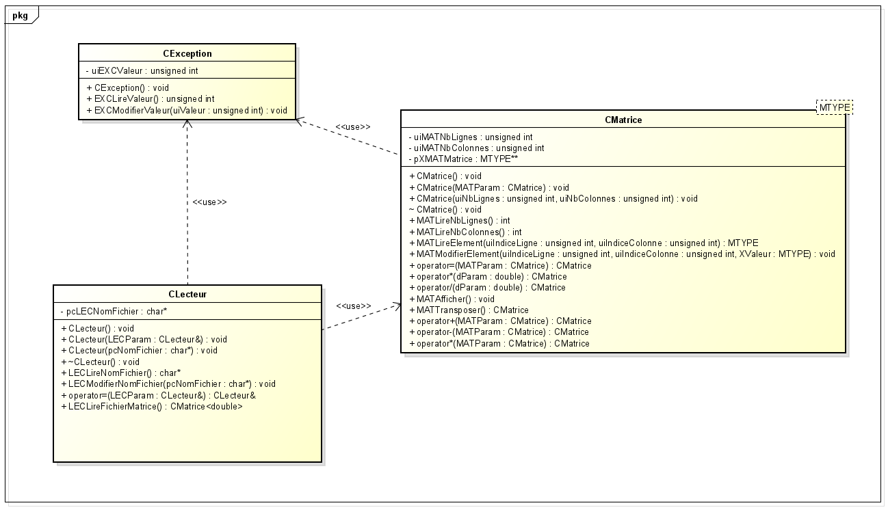

# ProjetTutoreCppS6PolytechToursMatrices

##Présentation
Projet de programmation d'une librairie de classes et de fonctions permettant de manipuler des matrices. Projet réalisé dans le cadre du projet tutoré C++ du sixième semestre du cycle ingénieur de Polytech Tours.

###Contenu
Le projet est composé de 3 éléments : 
- **CException** : une classe permettant de gérer les
exceptions qui surviennent dans le cadre des situation anormales mais prévisibles de fonctionnement
- **CMatrice\<MTYPE\>** : un patron (template) de classe permettant de manipuler des matrices contenant des éléments de type quelconque, type quelconque représenté par le type générique MTYPE
- **CLecteur** : une classe permettant de lire un fichier et de le manipuler, en particulier on va l’utiliser pour créer une Matrice de double à partir d’un fichier donné en paramètre de ligne de commande

###Diagramme de classes UML


##Manuel de l’utilisateur
###Lancer le programme
Afin de lancer le programme il suffit de placer vos fichiers de test en format txt rédigés
suivant le modèle suivant dans le même répertoire que l'exécutable :

```
TypeMatrice=<type_base_C>
NBLignes=<Nombre_de_lignes_de_la_matrice>
NBColonnes=<Nombre_de_colonnes_de_la_matrice>
Matrice=[
<Ligne_1 : autant d’éléments que de colonnes>
<Ligne_n : autant d’éléments que de colonnes>
…
<Ligne_NBLignes : autant d’éléments que de colonnes>
]
```

Par exemple :

```
TypeMatrice=double
NBLignes=3
NBColonnes=3
Matrice=[
-36.4 3 6
1 -2355 8
54 3.14 -35.3
]
```

Veillez à respecter le format du fichier :
- TypeMatrice égal à double
- NBLignes et NBColonnes sont positifs
- Le nombre de lignes et de colonnes doit concorder avec NBLignes et
NBColonnes

NB : Seul le type de matrice “double” qui correspond aux nombre réels est pris en charge pour le moment, il est donc impératif de spécifier “TypeMatrice=double”.

Enfin il vous faudra ouvrir un terminal Windows et vous placer dans le répertoire de
l’exécutable puis saisir la commande sous la forme suivante :

```
.\<nom de l'exécutable>.exe <nom du 1er fichier>.txt <nom du 2ème fichier>.txt …
```

Par exemple : 

```
.\PT_CPP_Matrices.exe test1.txt test2.txt test3.txt
```

Le minimum est d'un fichier mais vous pouvez ajouter autant de fichiers que vous le
souhaitez tant que les tailles des matrices sont compatibles pour les calculs, dans le cas
contraire, les calculs pouvant être effectués le seront et vous obtiendrez une erreur
pour les autres.

###Liste des codes erreurs
Notez que dans le cas où un code erreur serait indiqué sans précision, vous pouvez
vous référer au tableau récapitulatif suivant :

| Code | Nom | Classe |
| - | - | - |
| 1 | TailleNonCorrespondantes | CMatrice |
| 2 | MatriceVide | CMatrice |
| 3 | DepassementLigneOuColonne | CMatrice |
| 4 | DivisionPar0 | CMatrice |
| 5 | NomFichierManquant | CLecteur |
| 6 | EchecOuvertureFichier | CLecteur |
| 7 | FormatFichierInvalide | CLecteur |
| 8 | TypeMatriceFichierInvalide | CLecteur |